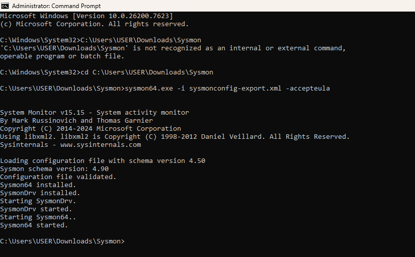
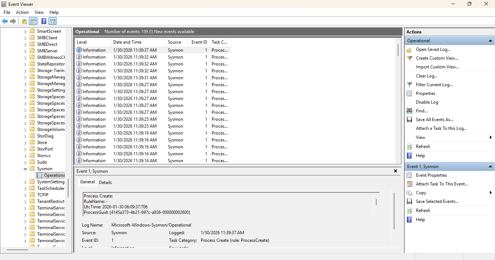

# 🛡️ Advanced Endpoint Monitoring & Detection with Sysmon

## 📌 Project Overview
In this hands-on lab, I implemented advanced system telemetry and monitoring on a Windows endpoint using **Microsoft Sysmon**. By deploying a customized, security-hardened configuration, I established a high-fidelity logging environment capable of detecting suspicious process executions and system modifications that often bypass standard Windows Event Logs.

---

## 🏗️ Configuration & Setup
* **Tool:** Microsoft Sysinternals Sysmon v15.15
* **Configuration:** SwiftOnSecurity Sysmon Config (Hardened Schema v4.50)
* **Monitoring Path:** `Applications and Services Logs > Microsoft > Windows > Sysmon > Operational`

---

## 🚀 Lab Milestones

### 1. Hardened Sysmon Deployment
Successfully installed Sysmon using a schema-validated configuration file to filter and capture only high-value security events, ensuring optimal performance and relevant data collection.

### 2. Real-time Process Visibility
Gained deep visibility into endpoint activity. The system successfully captured background process executions, including specialized services like `splunk-optimize.exe`, providing details like ProcessID, File Version, and full Image paths.

### 3. Forensic Log Analysis
Leveraged **Windows Event Viewer** to analyze **Event ID 1 (Process Creation)**. By examining raw event data, I was able to extract critical forensic artifacts such as:
* **Parent Process Relationships:** Tracking `svchost.exe` as a parent to system tasks.
* **File Integrity:** Capturing **SHA256 & MD5 hashes** for every executed process.
* **Privilege Tracking:** Identifying processes running under `NT AUTHORITY\SYSTEM` privileges.

---

## 🛠️ Tools Used
* **Sysmon:** Advanced endpoint telemetry and logging.
* **Event Viewer:** Log visualization and forensic investigation.
* **SwiftOnSecurity Config:** Industry-standard monitoring rules.

---

## 📸 Project Gallery

| Installation Success | Operational Log Overview | Detailed Event Analysis |
| :--- | :--- | :--- |
|  |  |  |
